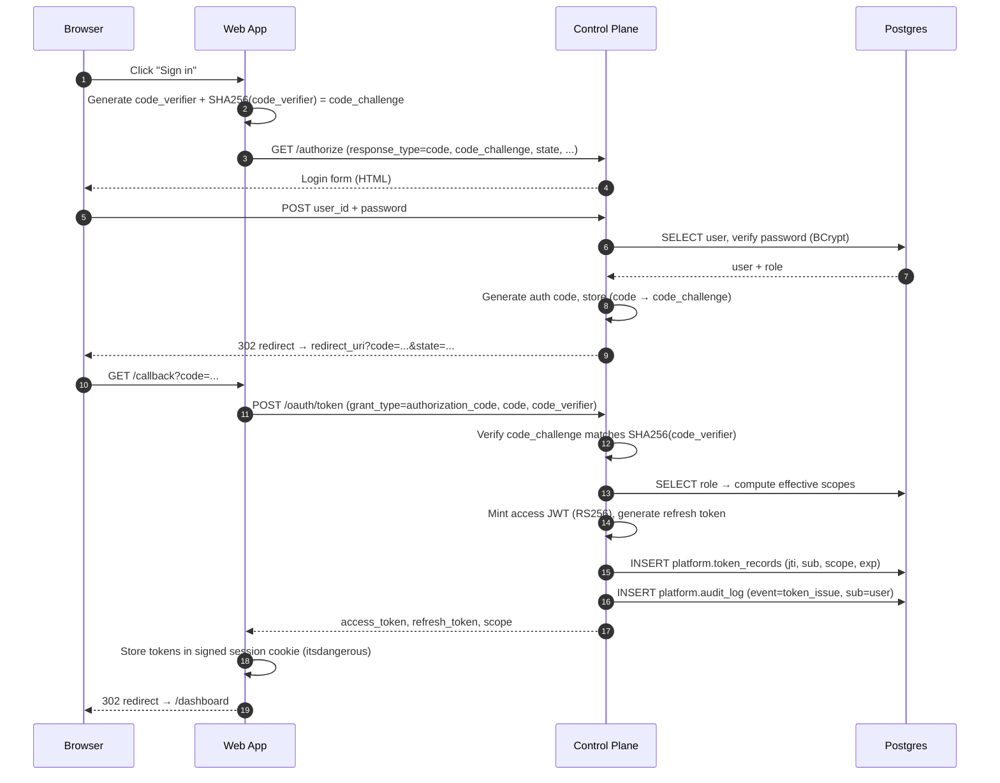
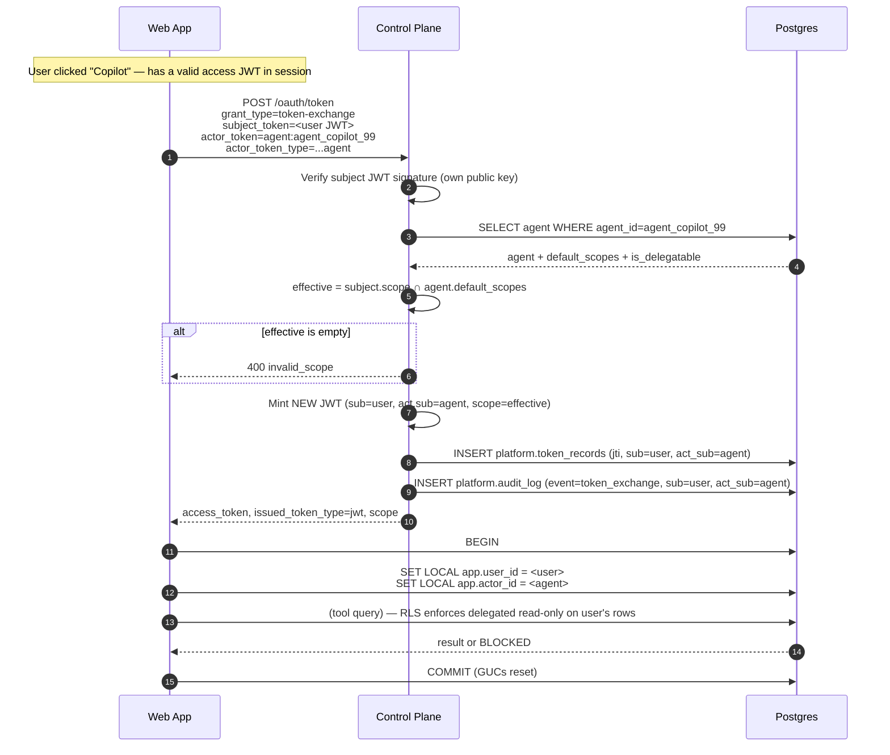
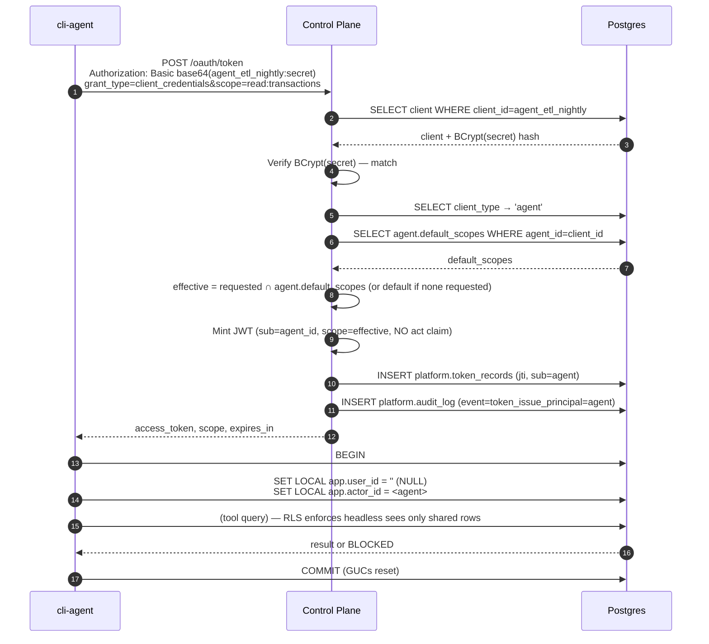
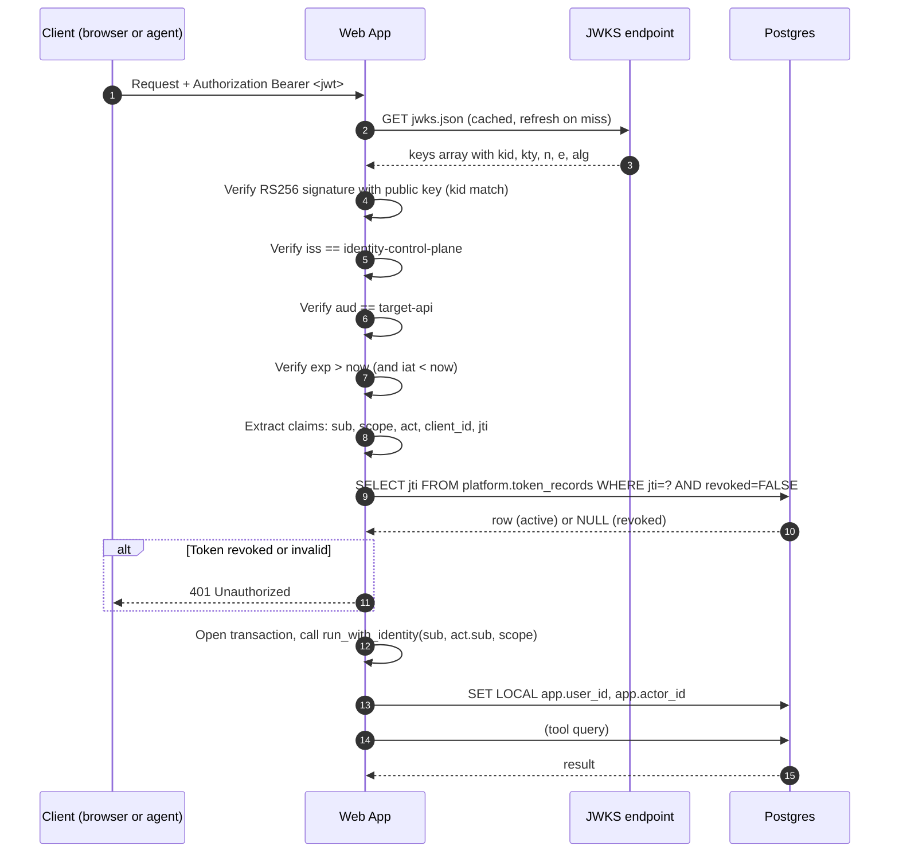
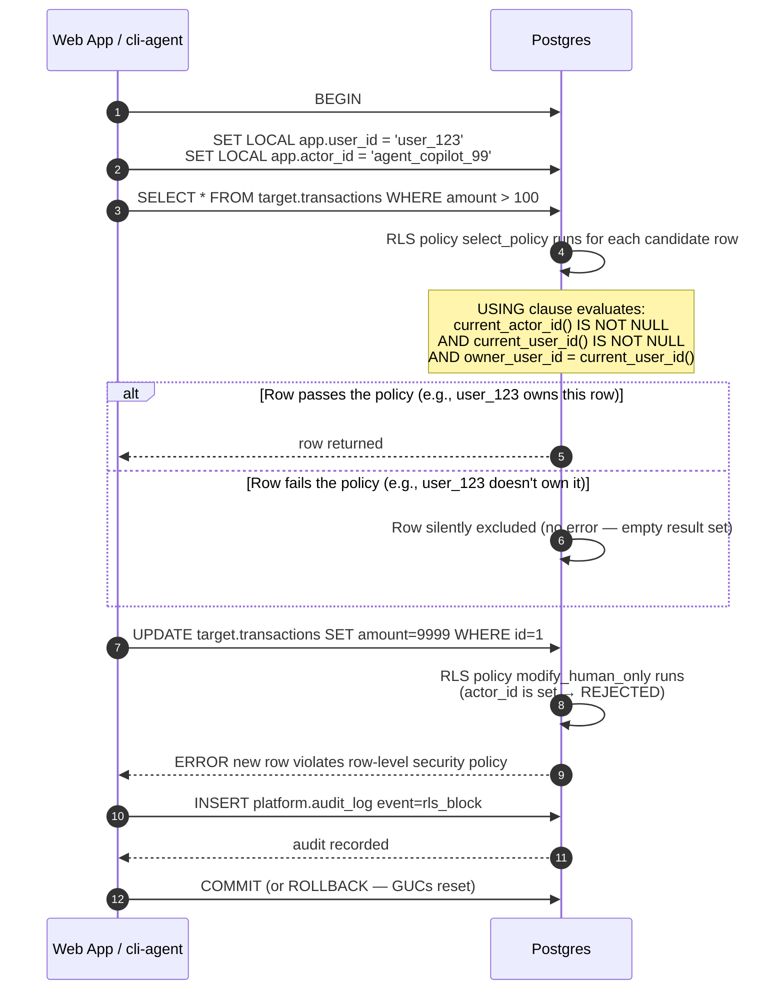
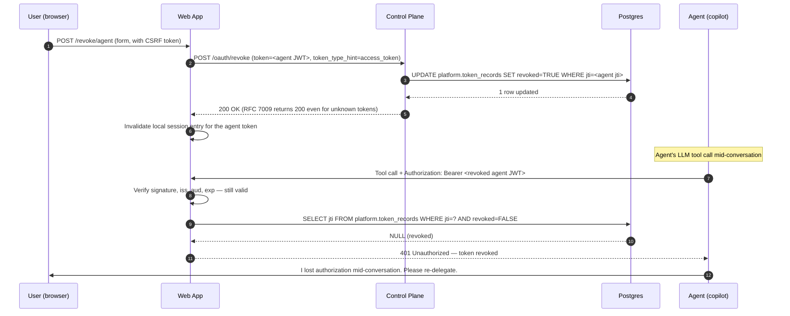

# Architecture: Local Identity & Agent Authorization Demo

## 0. How to Read This Doc

If you're new to the demo, read in this order:

1. **Purpose (§1)** — the problem this demo solves and the story it tells.
2. **The Three Principals (§2)** — the mental model: human / delegated agent / headless agent.
3. **Design Decisions: Why These Standards (§3)** — *why* OAuth 2.1, RFC 8693, PKCE, JWT+JWKS, RLS via GUCs, three-tier authz, separate AS, RS256, and a non-superuser DB role.
4. **System Components (§4)** — the moving pieces and how they connect.
5. **Token Lifecycle (§5)**, **Identity Propagation (§6)**, **OAuth Flows (§7)** — the mechanics, in order of depth. §7 has six Mermaid sequence diagrams including JWT verification, RLS enforcement, and revocation.
6. **Threat Model (§8)**, **FAQ (§9)** — explicit enumeration of what this demo defends against, plus 25+ Q&As on concepts, tech, ops, comparisons, and pitfalls.
7. **Audit & Observability (§10)**, **Security Properties (§11)** — the verification story.
8. **Glossary (§12)**, **Non-Goals (§13)**, **External IDP Integration (§14)**, **File Map (§15)** — reference material.

The Glossary (§12) defines every term used throughout (principal, actor, GUC, downscoping, etc.). Skip ahead to it whenever a term is unfamiliar. §14 explains how to swap the custom control plane for Okta/Auth0/Keycloak/etc. in production, including an RFC 8693 support matrix.

## 1. Purpose

Most AI agent demos connect to a database with a single broad service account. This means:

- An agent can do anything the service account can do
- Audit logs can't tell you **which user** triggered an action
- A compromised agent = full database access

This demo proves you can have **cryptographically verified, end-to-end identity propagation** from the user, through the OAuth token, into the database row-level security layer. No shared service account. No blind spots.

The story we tell:
- Three distinct principal types, each with its own auth flow
- Identity flows through every layer as a verifiable claim, not a trust assumption
- Authorization decisions happen at three layers (token scope → role → RLS), with the database as the last line of defense
- Full audit trail distinguishes "user did it" from "user's agent did it" from "autonomous agent did it on its own"

## 2. The Three Principals

| Principal | Token shape | Auth flow | RLS branch |
|---|---|---|---|
| **Human direct** | `sub=user_N`, no `act` | Authorization Code + PKCE | Own rows, full CRUD |
| **Delegated agent** (UI Copilot) | `sub=user_N`, `act.sub=agent_id` | RFC 8693 Token Exchange | User's rows, **read-only** |
| **Headless agent** (cron/CLI) | `sub=agent_id`, no `act` | OAuth 2.1 Client Credentials | Shared rows, **read-only** |

The visual signature in the UI:
- Human: `sub: "user_123"`, no `act`
- Delegated: `sub: "user_123"`, `act: { sub: "agent_copilot_99" }` ← human is the principal, agent is the actor
- Headless: `sub: "agent_etl_nightly"`, no `act` ← agent IS the principal

**Why exactly three?** The model is closed: every JWT has a `sub` (principal) and an optional `act` (actor). The principal is either a *human* or an *agent*. The actor, if present, is always an *agent*. That gives a 2×2 matrix of cells — minus the meaningless "(human acts as itself when there's no actor)" cell collapsing into one — yielding exactly **three** meaningful principal types:

| | No actor (`act` absent) | Actor = agent |
|---|---|---|
| **Principal = human** | Human direct (#1) | Delegated agent (#2) |
| **Principal = agent** | Headless agent (#3) | Nested delegation (out of scope — see §11) |

The cell "principal = human, actor = human" is meaningless (humans don't act on behalf of other humans in this model). The cell "principal = agent, actor = agent" is multi-hop delegation — explicitly out of scope (see §11). What remains is three cells, and that's the entire taxonomy.

## 3. Design Decisions: Why These Standards

### OAuth 2.1 (not OAuth 2.0)

OAuth 2.1 is the IETF's best-practices consolidation of OAuth 2.0. It drops legacy grant types and makes several security features mandatory rather than optional. We use it because:

- **Implicit grant is dead.** Tokens can never leak through URL fragments. Only authorization code + PKCE (for humans) and client credentials (for agents) remain.
- **PKCE is mandatory (S256 only).** Even in OAuth 2.0, PKCE was "recommended" — here it's required. This prevents authorization code interception attacks. The control plane rejects any `/authorize` request without a `code_challenge` or with a method other than `S256`.
- **No refresh tokens for client credentials.** In OAuth 2.0, a client credentials grant could return a refresh token, creating a long-lived credential for a machine. OAuth 2.1 says no. This demo's headless agents re-authenticate every tick instead of holding a persistent refresh token — a more realistic model for short-lived machine credentials.
- **Refresh token rotation.** OAuth 2.1 requires that each refresh replaces the old token. Our control plane revokes the old `jti` and issues a new one on every refresh, preventing stolen refresh tokens from being silently replayed.
- **RFC 7009 revocation.** Explicit token kill-switch, required by OAuth 2.1.

In short: OAuth 2.1 means we get the strongest OAuth-native posture out of the box — no legacy footguns, no optional security. Every flow in this demo would pass an OAuth 2.1 spec audit.

### RFC 8693 Token Exchange — delegated identity

Without RFC 8693, if a user wants an AI copilot to act on their behalf, you have two bad options:

1. **Pass the user's token directly** → the agent inherits the user's full permissions. A read-only copilot can suddenly write and delete.
2. **Give the agent its own identity** → the audit log says "agent_copilot_99 did it," losing the trail back to the human who asked.

RFC 8693 solves both by standardizing a token exchange where the authorization server mints a **new** JWT with:

| Claim | Meaning |
|---|---|
| `sub: user_123` | The **principal** — who is ultimately responsible |
| `act.sub: agent_copilot_99` | The **actor** — who executed the action |
| `scope: read:transactions` | The intersection of the user's permissions and the agent's allowed scope (downscoping) |

The `act` claim is defined in RFC 8693. Any compliant system can read it and distinguish "a human did this" from "a human's agent did this." The database's RLS policies use both `sub` and `act.sub` to enforce that delegated agents can only read the user's own rows, with no write capability — even if the human user has full CRUD.

### Authorization Code + PKCE (RFC 7636) — not just the code grant

Authorization code alone is vulnerable to interception: if an attacker steals the code from the redirect URI, they can exchange it for tokens. PKCE adds a cryptographic binding between the authorization request and the token request:

1. The web app generates a random `code_verifier` and a `code_challenge = SHA256(code_verifier)`.
2. The challenge is sent with `/authorize`. The control plane stores it alongside the auth code.
3. On `/oauth/token`, the web app sends the verifier. The control plane hashes it and compares against the stored challenge.
4. An attacker who intercepted the code does NOT have the verifier → the exchange fails.

We enforce **S256 only** (no `plain` fallback), as required by OAuth 2.1.

### JWT + JWKS (RS256) — cryptographic identity, not trust

Tokens are RS256-signed JWTs. The web app fetches the control plane's public key from `/.well-known/jwks.json` and **cryptographically verifies** every token (signature, issuer, audience, expiry) before trusting it. This means:

- The database never needs to call back to the control plane to validate a token — it verifies locally with the public key.
- No shared secret between the web app and the control plane. Only the control plane holds the private key.
- JWTs carry structured claims (`sub`, `scope`, `act`, `jti`) that every layer can read without a network round-trip.

### Why JWT at all? (vs opaque, PASETO, sessions)

JWT is a choice, not a given. The realistic alternatives are:

| Token format | What it is | What it costs | When to pick it |
|---|---|---|---|
| **JWT** (we use this) | Self-contained, signed. Verifiable locally with the issuer's public key. | Can't revoke instantly (signature still valid until `exp`). Larger (~200B). Claims are visible to the token-holder (signed, not encrypted). | Distributed verification needed; resource servers can't reach the AS on every request. |
| **Opaque tokens + introspection** (RFC 7662) | Random string. Resource server calls `POST /oauth/introspect` to learn the claims. | Every request needs a callback to the AS (or a cache). The AS is a hot-path dependency. | Instant revocation matters more than latency. Claims must be hidden from the client. |
| **PASETO** | Like JWT but designed to fix JWT's footguns (no `alg:none`, no algorithm confusion, encrypted by default). | Smaller ecosystem. Fewer libraries. No `jwt.io`-equivalent inspector. | Greenfield systems that don't need JWT ecosystem interop. |
| **Stateful session cookies** | Random ID, server looks up the session in a DB/Redis. | The session store becomes the trust anchor. Multi-region gets complicated. State doesn't compose well across services. | Single-server web apps. No inter-service verification. |

**Why JWT for this demo specifically:** the demo's whole thesis is "identity flows cryptographically to the data layer." That *requires* the database itself to verify tokens — no callback, no trust assumption. JWT is the only format that lets the DB verify locally with the issuer's public key. With opaque tokens, the DB would have to call the control plane on every query, which re-introduces the trust assumption the demo is trying to eliminate.

**When production picks differently:**
- **High-stakes revocation** (financial, healthcare) → opaque + introspection. The latency cost is worth instant kill.
- **Claims contain PII** → opaque (or JWE-encrypted JWT, much rarer).
- **Greenfield + security paranoid** → PASETO. Avoids the entire JWT algorithm-confusion attack class.
- **Single web app, no internal APIs** → session cookies. Why involve tokens at all?

**The "split the world" pattern** (what mature systems actually do): use both. JWT for service-to-service calls where latency matters. Opaque + introspection for high-security endpoints where revocation matters. Session cookies for browser-to-web-app. Each tool used where it fits — the "JWT vs opaque" debate is a false dichotomy in production.

See FAQ §9 for a shorter version of this comparison.

### Postgres RLS via GUCs (`SET LOCAL`) — identity into the database

The core identity propagation pattern: the application sets Postgres session variables (`SET LOCAL app.user_id, app.actor_id`) before executing queries, and RLS policies read those variables to enforce row-level access:

- **`SET LOCAL`** means the variables are scoped to the current transaction. After commit/rollback, they reset. This is safe under connection pooling — no other request sees stale identity state.
- **Why not pass identity as query parameters?** Prevents SQL injection risk and keeps identity out of query logs. The GUCs live in the session, not the SQL text.
- **RLS as the last line of defense:** even if token scope validation and role mapping are bypassed, the database itself enforces that a delegated agent cannot write, and a headless agent can only see shared rows.

### Three-tier authorization — defense in depth

| Tier | What enforces it | Example |
|---|---|---|
| 1. Token scope | Control plane at issuance | Agent JWT has `scope=read:transactions` — the web app can check this without a DB call |
| 2. Role mapping | `platform.roles` + `platform.role_scopes` in the DB | `senior_analyst` gets R+W, `junior_analyst` gets R only |
| 3. Row-level security | Postgres RLS policies | `owner_user_id = current_user_id()`; agent can't read rows it doesn't own |

No single layer is trusted to get it right. The database is the last and strongest line.

### Why a separate authorization server?

The control plane is a different process from the web app. That's deliberate. Three reasons:

1. **Single Responsibility.** Auth code is hard to get right (CSRF, session fixation, password hashing, rate limiting, lockout, ...). Concentrating it in one well-reviewed service is safer than re-implementing it in every application.
2. **Specialization.** Adding MFA, SAML federation, or social login means upgrading *one* service, not every web app. Swapping the control plane for Okta in production (§14) is a configuration change, not a rewrite.
3. **Independent deployment and scaling.** The web app can be scaled horizontally without worrying about auth state; the control plane can be scaled independently based on login volume. They can fail over separately.

The trade-off: one more service to operate. For a single-app demo this is overkill, but for any organization running more than one application it pays for itself immediately.

### Why RS256, not HS256?

Both are JWT signing algorithms, but they differ in a security-critical way:

| Algorithm | Key model | Who can verify? | Who can forge? |
|---|---|---|---|
| **HS256** (HMAC-SHA256) | Symmetric — one secret | Anyone with the secret | Anyone with the secret |
| **RS256** (RSA-SHA256) | Asymmetric — key pair | Anyone with the **public** key | Only the holder of the **private** key |

In this demo, the control plane signs with a private RSA key. The web app, the database connection pool, and any other service can verify tokens using the public key from `/.well-known/jwks.json` — but none of them can forge a new token.

Why this matters in distributed systems: with HS256, every service that needs to verify a token also needs the signing secret — and a service that holds the secret can mint tokens for *any* user. With RS256, the public key is genuinely public. You can paste it on a billboard. The private key never leaves the control plane.

This is also why key rotation works without downtime: publish a new public key with a new `kid`, retire the old one after the cache TTL expires. The control plane doesn't have to coordinate with every verifier.

### Why a non-superuser database role?

The web app connects to Postgres as `app_session`, **not** as `postgres`. Postgres only enforces RLS for non-superuser connections (superusers bypass RLS by design). This is **principle of least privilege** at the database layer:

| Role | What it can do | Used by |
|---|---|---|
| `postgres` | Everything, bypasses RLS | `init.sql` only — schema setup |
| `control_plane_admin` | Read/write `platform.*` tables, can't bypass RLS on `target.*` | Control plane (audit log + token records) |
| `app_session` | CRUD on `target.*`, RLS enforced, no schema changes | Web app + cli-agent (the *only* role that runs user-driven queries) |

If an attacker compromises the web app, they can issue queries as `app_session` — but RLS still filters what rows they can see, and they cannot `DROP TABLE`, alter policies, or impersonate other identities. The blast radius of a web app compromise is bounded by the database role's permissions.

This is why the web app never holds DB admin credentials. Production note: in a real deployment you'd also want network-level isolation (separate DB users per service, network policies, mTLS) — see §13 for the full list of production concerns.

### Why Postgres specifically?

Every other choice in this demo — JWT for distributed verification, `SET LOCAL` for identity propagation, RLS as the last line of defense — *requires* Postgres. Or a database with equivalent features, of which there are very few:

| Database | Row-level security | Session GUCs (`SET LOCAL`) | Verdict |
|---|---|---|---|
| **Postgres** (this demo) | ✅ First-class (`CREATE POLICY ... USING`) | ✅ First-class | Picked |
| Oracle | ✅ Fine-grained access control | ✅ Session-level `ALTER SESSION` | Would work; commercial |
| SQL Server | ✅ Security policies | ✅ `SET CONTEXT_INFO` | Would work; commercial |
| MySQL | ❌ No row-level security | ⚠️ Session vars exist but no policy integration | **Fails the core requirement** |
| MongoDB | ❌ No row-level security | N/A | **Fails the core requirement** |
| DynamoDB | ⚠️ IAM policies per-item (coarser) | N/A | Different model |
| SQLite | ❌ No row-level security | N/A | **Fails the core requirement** |

RLS is the demo's **last line of defense**. Without it, identity would have to be enforced at the application layer, which is exactly the trust assumption we're trying to eliminate. So Postgres (or one of the commercial equivalents) is mandatory. We picked Postgres specifically because:

- **Open source** — no licensing to discuss for an educational demo.
- **Mature RLS** — `CREATE POLICY` is well-documented, predictable, and has been stable since 9.5 (2016).
- **`SET LOCAL` semantics** — transaction-scoped, automatically reset on commit/rollback, safe under connection pooling. Some other databases require explicit reset logic.
- **Ecosystem** — every language has good Postgres drivers; `psycopg` is excellent.

The dependency on Postgres is a real constraint. If you adapt this pattern to MySQL, you'd need to enforce row-level access in application code, which sacrifices the "database is the last line of defense" property.

### Why split between browser sessions and API JWTs?

The demo uses **two different auth mechanisms** depending on who the client is:

| Direction | Mechanism | Why |
|---|---|---|
| **Browser → web app** | Signed session cookie (`itsdangerous` URLSafeTimedSerializer) | Stateful — server can revoke by deleting the session cookie. Browser UX needs "stay logged in" and "logout everywhere." |
| **Web app → control plane** | None — same Python process | Internal function calls |
| **Web app / cli-agent → DB** | JWT in `Authorization: Bearer` header (verified by `run_with_identity`) | Stateless — distributed verification. The DB itself checks the signature. |

This is the **split-the-world pattern** (§3 "Why JWT at all?") in action within a single codebase. Browser sessions are stateful because the browser is a known, semi-trusted client that benefits from instant server-side revocation ("logout everywhere"). API tokens are stateless because the resource servers (the database, the control plane's `/oauth/userinfo`, etc.) can't all share a session store and shouldn't need to.

A common mistake is to use JWTs for *both* (because "JWTs are modern") — but that gives browser sessions the wrong properties: they can't be revoked instantly, can't be logged out everywhere, and reveal claims to the client. The demo's split is deliberate.

### Why in-band `jti` revocation

JWTs are normally self-contained — the signature + `exp` is enough to verify. But this demo does an *extra* step on every API request:

```sql
SELECT jti FROM platform.token_records WHERE jti = %s AND revoked = FALSE
```

Why bother? Because **JWTs can't be revoked instantly.** A token with `exp` one hour from now will be accepted for the full hour, even if you know it was leaked. The `jti` lookup lets the control plane flip `revoked=TRUE` and the very next request returns 401.

The trade-off:

| Strategy | Revocation latency | Per-request cost |
|---|---|---|
| Short TTL only (no `jti` lookup) | Up to `exp` window (1h for us) | Zero — pure signature verification |
| **`jti` revocation list** (this demo) | **Next request** (sub-second) | One indexed PK lookup per request (~0.5ms) |
| Opaque tokens + introspection | Instant (kill in AS, next introspect fails) | Network round-trip to AS |

We chose `jti` lookup because it gives instant revocation at the cost of one indexed lookup per request — cheap, and the indexed `jti` primary key makes it O(1). The cost is small because:

- The lookup is a primary-key index hit — microseconds, not milliseconds.
- The `revoked=TRUE` filter uses the same index, so even with millions of revoked tokens, the lookup stays fast.
- The alternative (waiting up to 1h for token expiry) is unacceptable for the demo's revocation demo (Demo 2c in RUNBOOK.md).

In production at higher scale, you'd back this with a cache (Redis with a short TTL on `jti → active`) or move to opaque + introspection for high-stakes endpoints where the lookup overhead is unacceptable.

## 4. System Components

```
┌─────────────────────┐
│  User Browser       │
└──────────┬──────────┘
           │ (Auth Code + PKCE)
           ▼
┌──────────────────────────────────────┐
│ Web App (FastAPI + Jinja/HTMX)        │
│ - 3 buttons: Human | Copilot | Headless│
│ - Chat panel for LLM tool-calling     │
│ - Live audit + LLM turn feeds         │
└────┬─────────────────────┬───────────┘
     │ RFC 8693            │ psycopg SET LOCAL
     │ Token Exchange      │
     ▼                     ▼
┌─────────────┐     ┌──────────────┐
│ Control     │     │ identity-db  │
│ Plane       │     │ - platform.* │
│ (FastAPI)   │     │ - target.* + │
│ - /authorize│     │   RLS        │
│ - /oauth/   │     └──────────────┘
│   token     │            ▲
│ - /jwks.json│            │
│ - /oauth/   │            │ (direct, as app_session)
│   userinfo  │     ┌──────┴───────┐
│ - /oauth/   │     │ cli-agent/   │
│   introspect│     │ (Python CLI) │
│ - /oauth/   │     └──────────────┘
│   revoke    │            ▲
└─────────────┘            │
                           │ Client Credentials
                           └── via /oauth/token
```

**3 containers + 1 host-side script:**
- `identity-db` (postgres:16-alpine, port 54321)
- `control-plane` (python:3.12-slim, port 18080)
- `web-app` (python:3.12-slim, port 13000)
- `cli-agent/` (Python script, runs on host or via `docker compose run`)

**Network:** `identity-net` (bridge).
**LLM:** External OpenAI-compatible endpoint (user-provided URL + key + model).

## 5. Token Lifecycle

### Issuance paths

| Grant type | Endpoint | Who | Token claims |
|---|---|---|---|
| `authorization_code` | `POST /oauth/token` | Human user via web-app | `sub`, `scope` from role, no `act` |
| `refresh_token` | `POST /oauth/token` | Human user | Same as above, fresh `jti` |
| `urn:ietf:params:oauth:grant-type:token-exchange` | `POST /oauth/token` | Web-app (delegating) | `sub=user`, `act.sub=agent`, scope downscoped |
| `client_credentials` | `POST /oauth/token` | Headless agent (cli-agent or web-app proxy) | `sub=agent`, scope from agent defaults, no `act` |

### Issued JWT shape

```json
{
  "iss": "identity-control-plane",
  "aud": "target-api",
  "sub": "user_123",          // or "agent_etl_nightly" for headless
  "scope": "read:transactions", // space-separated
  "client_id": "web-app",       // or "agent_etl_nightly"
  "jti": "uuid",                // tracked in platform.token_records
  "iat": 1782718480,
  "exp": 1782722080,
  "act": { "sub": "agent_copilot_99" }  // present ONLY for delegated tokens
}
```

### Refresh + revocation

- Humans get a refresh token (opaque, 8h TTL) at issuance
- On refresh: old `jti` is marked `revoked=TRUE` in `platform.token_records`
- `POST /oauth/revoke` (RFC 7009) lets a user explicitly kill an active token
- After revoke, subsequent calls with that token return 401 from `/oauth/userinfo` and "active: false" from `/oauth/introspect`
- Headless agent tokens are NOT refreshable — agent re-authenticates each tick (realistic for short-lived credentials)

## 6. Identity Propagation: JWT → Postgres GUC → RLS

This is the core pattern, used in three places.

### The pattern

```python
# In web-app or cli-agent, before executing a tool:
with psycopg.connect(...) as conn:
    with conn.cursor() as cur:
        cur.execute("SELECT set_config('app.user_id', %s, true)", (user_id or "",))
        cur.execute("SELECT set_config('app.actor_id', %s, true)", (actor_id or "",))
    # Now do the actual work
    cur.execute("SELECT ... FROM target.transactions ...")
```

The `true` flag means `SET LOCAL` — the GUCs are scoped to the current transaction. After `commit()` or `rollback()`, they reset. This is safe under connection pooling.

### RLS reads the GUCs

```sql
CREATE POLICY select_policy ON target.transactions FOR SELECT
USING (
  -- Human direct: own rows
  (current_actor_id() IS NULL AND current_user_id() IS NOT NULL
     AND owner_user_id = current_user_id())
  OR
  -- UI-delegated agent: read user's own rows
  (current_actor_id() IS NOT NULL AND current_user_id() IS NOT NULL
     AND owner_user_id = current_user_id())
  OR
  -- Headless agent (no user, only actor): shared rows only
  (current_actor_id() IS NOT NULL AND current_user_id() IS NULL
     AND is_shared = TRUE)
);
```

### Three-tier policy as defense in depth

1. **Token scope** (issued by control plane): the agent JWT has `scope=read:transactions` only
2. **Role mapping** (in `platform.role_scopes`): senior_analyst gets R+W, junior_analyst gets R
3. **RLS** (last line of defense): row-level + principal-type enforcement

Even if all three were bypassed, the database itself rejects unauthorized actions.

### Policy catalog: where every authorization decision is defined

This sub-section is the **map to the source of truth** for every "who can do what" rule in the system. If you're trying to answer "where is this policy defined?" or "what do I change to allow X?" — start here.

#### Layer 1: RLS policies (SQL, in `db/init.sql`)

The row-level access logic is in SQL because the database is the last line of defense. RLS policies are **DDL** — changing them requires `make reset` (rebuilds the DB from `init.sql`).

| Policy | Location | What it enforces |
|---|---|---|
| `select_policy` | `db/init.sql:218` | SELECT for any principal type, scoped by `current_user_id()` / `current_actor_id()` |
| `modify_human_only` | `db/init.sql:234` | INSERT/UPDATE/DELETE only when `current_actor_id() IS NULL` — agents can never write |

Both policies read `current_user_id()` and `current_actor_id()` — helper functions defined earlier in `init.sql` that wrap `current_setting('app.user_id')` and `current_setting('app.actor_id')`.

#### Layer 2: Role and agent scope data (rows in `platform.*` tables)

The mapping from "role/agent" → "allowed scopes" is **data**, not code. Changing these tables takes effect on the next token issuance — no restart, no redeploy.

| Table | Location | What it stores |
|---|---|---|
| `platform.roles` | `db/init.sql:35` (DDL), `:46` (seed) | Role catalog: `senior_analyst`, `junior_analyst`, `auditor` |
| `platform.role_scopes` | `db/init.sql:40` (DDL), `:51` (seed) | Role → scope rows: `senior_analyst` → R+W, `junior_analyst` → R, `auditor` → R |
| `platform.agents` | `db/init.sql:105` (DDL) | Agent catalog with `default_scopes TEXT[]` column — what scope an agent gets by default during delegation |
| `platform.clients` | `db/init.sql` (DDL) | OAuth client registry (web app + headless agents) with per-client `allowed_scopes` |

#### Layer 3: Scope computation (Python services in the control plane)

The control plane reads the data tables above and computes the **effective scope** for each token issuance. This is **code**, not data — changing it requires redeploying the control plane.

| File | Function | What it does |
|---|---|---|
| `control-plane/app/services/roles.py:7` | `get_role_scopes(role)` | Reads `platform.role_scopes` for a role |
| `control-plane/app/services/roles.py:17` | `compute_effective_scopes(role, requested)` | `role_scopes ∩ requested` — the downscope formula for human users |
| `control-plane/app/services/agents.py` | `get_agent(agent_id)` | Reads `platform.agents.default_scopes` for token exchange |
| `control-plane/app/routes/token.py` | grant handlers | Calls the above at issuance time for all four grant types |

#### The "what do I change to allow X?" cheat sheet

| If you want to… | Edit… | Redeploy needed? |
|---|---|---|
| Add a new role (e.g., `contractor`) | `INSERT INTO platform.roles` + rows in `platform.role_scopes` | No — picked up on next token issuance |
| Change what an existing role can do | `UPDATE/INSERT/DELETE` on `platform.role_scopes` | No |
| Add a new agent | `INSERT INTO platform.agents (agent_id, default_scopes, is_delegatable)` | No |
| Change what an agent gets by default | `UPDATE platform.agents SET default_scopes = ...` | No |
| Add a new scope string (e.g., `delete:transactions`) | 1) New RLS policy in `db/init.sql` <br> 2) Add to `platform.role_scopes` for human roles <br> 3) Add to `platform.agents.default_scopes` for agents <br> 4) Add to web app's tool definitions | **Yes** for (1) and (4) — `make reset` + web app redeploy. (2) and (3) are data changes. |
| Change the downscope formula | `control-plane/app/services/roles.py` | **Yes** — control plane redeploy |
| Change who can write at all | `db/init.sql` `modify_human_only` policy | **Yes** — `make reset` |
| Revoke all tokens for a user | `UPDATE platform.token_records SET revoked=TRUE WHERE sub=...` | No — takes effect on next request |

#### Why this split?

This is **policy-as-data + policy-as-code**, deliberately:

- **Roles and agent defaults are data** because business changes frequently ("junior analyst gets read-only of shared rows too"). Data changes ship in seconds via SQL, no engineering ticket.
- **RLS policies are code** because they're security-critical and changing them should require a code review, a schema migration, and a rebuild. You don't want a junior engineer changing `modify_human_only` via a UI.
- **Scope computation is code** because it's the trust boundary — the `effective = subject.scopes ∩ agent.scopes` line is *the* delegation-safety invariant. It deserves the rigor of a code review.

The trade-off: the "what changes require what" matrix above is the operational cost. In production you'd add policy-as-code tools (OPA, Cedar) and a CI check that flags `platform.role_scopes` changes without an accompanying change ticket.

## 7. OAuth Flows (Sequence)

The diagrams below use [Mermaid](https://mermaid.js.org/), which GitHub renders natively.

### 7.1 Authorization Code + PKCE (Human)



### 7.2 RFC 8693 Token Exchange (Delegated Agent)



### 7.3 Client Credentials (Headless Agent)



### 7.4 JWT Verification (every incoming request)

This is what the web app does **before trusting any token** — it never calls back to the control plane.



### 7.5 RLS Enforcement (database as last line of defense)

When a tool query runs, the database itself rejects unauthorized rows — even if the web app's token-scope check is wrong.



### 7.6 Token Revocation (RFC 7009)

When a user clicks "Revoke Agent Delegation", the agent's token dies immediately — even mid-conversation.



## 8. Threat Model

This section enumerates the threats this demo defends against, the mechanism that stops each, and the threats that fall outside the demo's scope. It's the bridge between the design decisions (§3) and the security properties (§11): every defense has a corresponding threat, and vice versa.

### Threats explicitly defended against

| Threat | How this demo defends |
|---|---|
| **Forged access token** (attacker mints a JWT without the control plane's key) | RS256 signing + JWKS verification. The attacker doesn't have the private key — see §3 ("Why RS256, not HS256?"). |
| **Authorization code interception** (attacker steals the `?code=` from the redirect) | PKCE (S256). The control plane stored a `code_challenge`; only the legitimate client holds the matching `code_verifier` — see §3. |
| **Stolen refresh token replay** | OAuth 2.1 refresh token rotation + RFC 7009 revocation. Each refresh issues a new token and revokes the old `jti`. A stolen refresh token can only be used once before it's dead — see §7.1. |
| **Compromised agent reads user's private data** | RFC 8693 downscoping + RLS. The agent's effective scope is the intersection of its defaults and the user's grants; RLS filters by `current_user_id()` — see §3, §7.2, §7.5. |
| **Compromised agent writes/deletes** | RLS `modify_human_only` policy. Any write with a non-null `current_actor_id()` is rejected by Postgres, even if the human user could have written — see §7.5. |
| **Headless agent accesses a specific user's rows** | RLS `current_user_id() IS NULL` branch. Headless agents only see rows where `is_shared=TRUE` — they cannot impersonate a user because there is no user `sub` to set. |
| **Token theft via SQL injection** (attacker injects a different `sub` into a query) | Identity is set via Postgres GUCs, not query parameters. The SQL text never contains user identity — see §3 ("Postgres RLS via GUCs"). |
| **Token theft via Postgres logs** | GUCs are session state, not in SQL text. They don't appear in `pg_stat_statements`, slow query log, or application logs. |
| **Cross-tenant data leak** (request from user A inherits identity from a previous user B) | `SET LOCAL` is transaction-scoped. After commit/rollback, GUCs reset. Connection pool can't leak identity between requests — see §3. |
| **LLM hallucinates a destructive action** | Tool calls run with the agent's identity. RLS rejects writes. The attempt is logged to `platform.audit_log` and surfaced in the UI as a BLOCKED result — see §10. |
| **User keeps an agent running after changing their mind** | RFC 7009 revocation. The user clicks "Revoke Agent Delegation"; the control plane flips `revoked=TRUE` on the `jti`; the web app's revocation check rejects the next request — see §7.6. |
| **Audit gap** ("we don't know who did this") | Every token event (issue, exchange, refresh, revoke) and every RLS block is written to `platform.audit_log` with `sub` + `act_sub` + `client_id` + `agent_id` — see §10. |
| **Production-style downgrade attack** (attacker forces the flow to use a weaker algorithm) | OAuth 2.1 enforcement: no implicit, no password, no `plain` PKCE. The control plane rejects non-S256 challenges at `/authorize`. |
| **Client secret leaks from one service to another** | Client credentials (headless agents) are bound to a specific `client_id` and `allowed_scopes`. The agent's claims are its own — it cannot impersonate a user because there's no user to impersonate. |

### Threats this demo does NOT defend against

These are real threats, but they're explicitly out of scope. Each is mitigated in production by infrastructure, processes, or components this demo does not include.

| Threat | Why this demo doesn't defend against it | What production does |
|---|---|---|
| **Compromised authorization server** (attacker steals the signing key) | The demo holds `signing.pem` in a file on disk | HSM (AWS CloudHSM, GCP KMS, Azure Key Vault); key rotation via JWKS `kid`; multi-party signing |
| **Compromised web app code** | Demo assumes the web app is trusted | Code signing, supply-chain security (Sigstore, SLSA), runtime app self-protection (RASP) |
| **Compromised DB admin** (someone with `control_plane_admin` modifies audit logs) | Anyone with that role can in principle mutate `platform.audit_log` | INSERT-only role for audit writes, hash-chain triggers, append-only log store (AWS QLDB, immudb), external SIEM |
| **Compromised user device** (attacker has the user's password *and* MFA) | Demo has no MFA — see §13 | MFA, WebAuthn, device binding, risk-based authentication, anomaly detection |
| **Insider threat with DB access** | Demo runs on localhost with a single trust boundary | Separation of duties, just-in-time access, database activity monitoring (DAM), privileged access management |
| **Network MITM** (attacker intercepts HTTP traffic) | Demo is HTTP-only on localhost — see §13 | TLS everywhere, mTLS for service-to-service, HSTS, certificate pinning |
| **LLM prompt injection bypasses tool guards** | The LLM is trusted to follow its system prompt; tools execute whatever the LLM asks for | Output filtering, structured tool constraints, separate "action approval" model, human-in-the-loop for destructive ops |
| **Denial of service** | Demo has no rate limiting | Rate limiting at the edge, WAF, autoscaling, circuit breakers |
| **Token theft via browser extensions / XSS** | Demo doesn't have CSP or strict cookie attributes | Strict CSP, `SameSite=strict` cookies, `__Host-` cookie prefix, output encoding |
| **Authorization policy drift** (someone changes `platform.role_scopes` and breaks things silently) | No version history on the policy tables — see §13 | Policy-as-code (OPA, Cedar), change tracking, policy diffs in CI |

### Residual risks (within scope, but worth naming)

Even within what this demo *does* defend, there are still residual risks:

- **The control plane's `client_secret` for the web app and headless agent are in `.env`.** Anyone with read access to the repo in production can rotate those. This is a demo-scope concern, not a design flaw — production uses a secrets manager.
- **The audit log is only as trustworthy as the database.** If the DB itself is compromised (admin-level access), the audit log can be rewritten. Mitigated by the INSERT-only / append-only approaches listed above.
- **The LLM may not always attempt a write** during the demo (depends on the model and prompt). If the LLM never tries, the RLS-block story can't be shown — but the *defense* is still in place and provable via direct SQL.

### How to use this section

When evaluating the demo, walk down the "defended against" table and ask: *"is the mechanism actually wired up in the code?"* Cross-reference each row with the file map (§15) and verify the implementation. Then look at the "not defended" table and decide which of those matter for *your* threat model before deploying.

## 9. FAQ

Common questions, organized by category. For live-demo Q&A prep see [RUNBOOK.md §9 Talking-Point Cheat Sheet](RUNBOOK.md#9-talking-point-cheat-sheet-one-pager).

### Conceptual

**Q: What's the difference between authentication and authorization?**
A: **Authentication** = proving *who* you are (the PKCE flow proves the user is who they claim to be; the client credentials flow proves the agent is who it claims to be). **Authorization** = deciding *what* you're allowed to do (scope checks, role mappings, RLS). This demo does both, in distinct layers — auth at the control plane, authz at three tiers (§3).

**Q: What's the difference between delegation and impersonation?**
A: **Delegation** = agent acts on the user's behalf. The audit trail records both principal (user) and actor (agent). **Impersonation** = agent *becomes* the user; the trail shows only the agent, losing the connection back to who asked. This demo uses delegation via RFC 8693, which carries an `act` claim to preserve the principal/actor distinction. Impersonation is an anti-pattern for agent scenarios because you can't tell who triggered an action.

**Q: Why OAuth and not SAML?**
A: OAuth is for delegated API authorization — what an agent or web app needs to call APIs on a user's behalf. SAML is for browser-based SSO between an identity provider and a service. OAuth has richer token semantics (scopes, `act`, `jti`) that are well-suited to the agent scenario. For AI agents calling databases and APIs, OAuth (specifically OAuth 2.1 + RFC 8693) is the right tool.

**Q: What's the difference between an ID token and an access token?**
A: **ID token** = OIDC, proves user identity to the *client* (browser). It's consumed by the client and not forwarded. **Access token** = proves authorization to call *resource APIs*. It's forwarded with every API request. This demo issues access tokens only — the database doesn't need or want an ID token.

**Q: Why three principals and not just "users" and "services"?**
A: Because the delegated agent is *neither* — it acts on behalf of a user (so it's not a pure service) but executes actions itself (so it's not the user). Collapsing it into either category loses the audit trail. The three-principal model makes the principal/actor distinction first-class — see §2.

### Technical

**Q: Why JWTs and not opaque tokens?**
A: JWTs are self-contained. The database (or any service) can verify them locally with the public key from JWKS — no network callback to the control plane. Opaque tokens are random strings that require an introspection call to the AS on every request, which would mean the database trusts whatever the control plane says at request time. JWTs make identity *cryptographically verifiable*, not *trusted*. The deeper trade-off — JWT vs opaque vs PASETO vs sessions, and when each is right — is covered in §3 ("Why JWT at all?"). The short version: this demo needs the *database* to verify tokens locally, which forces JWT. Production systems often run *both* — JWT for service-to-service, opaque + introspection where instant revocation matters, sessions for browser-only.

**Q: Why scopes and not roles directly in the token?**
A: Scopes are fine-grained permissions (`read:transactions`, `write:transactions`). Roles are *bundles* of scopes (`senior_analyst` = R+W). Putting scopes in the token — and roles in a database table — lets you do scope intersection cleanly during token exchange (`effective = subject.scopes ∩ agent.default_scopes`, see §7.2) without re-issuing tokens when role definitions change.

**Q: What stops an agent from claiming a different actor identity?**
A: Two things. (1) The control plane verifies the actor exists in `platform.agents` and has `is_delegatable=TRUE` before issuing a token. (2) The web app only requests delegation for agents registered in its own config — so a malicious LLM can't ask for `act=agent_ceo_with_full_access`. See `control-plane/app/routes/token.py:_grant_token_exchange`.

**Q: How is this different from an API gateway that injects user ID into requests?**
A: An API gateway injecting user identity is a *trust* mechanism — if the gateway is misconfigured or compromised, the wrong identity propagates everywhere. RS256 JWTs are a *cryptographic* mechanism — every layer verifies the signature independently. The database doesn't have to trust the web app or the gateway; it verifies the token itself. Trust assumptions scale linearly with components; cryptographic verification scales with the key strength.

**Q: Why not use OPA (Open Policy Agent) instead of Postgres RLS?**
A: OPA is excellent for centralized policy across many services with Rego DSL. Postgres RLS is excellent for row-level enforcement with low latency in the database itself. They're complementary. This demo uses RLS because the database is the last line of defense for *row-level* access — and pushing every row check to an external service adds latency and a network dependency. In production, OPA and RLS often coexist: OPA for service-level authz, RLS for data-level authz.

**Q: Why not pass user identity as a query parameter?**
A: Three reasons (see §3 "Postgres RLS via GUCs"): (1) query parameters can be tampered with via SQL injection even with parameterization — GUCs are set server-side, not in SQL text; (2) GUCs don't appear in `pg_stat_statements` or query logs, so identity doesn't leak; (3) `SET LOCAL` is transaction-scoped, safe under connection pooling.

**Q: What's the latency overhead of JWT verification + DB roundtrip?**
A: RS256 signature verification with a cached JWKS is ~0.1ms. A Postgres `SET LOCAL` + simple query is ~0.5ms. Total overhead is under 1ms per request — invisible in any real API. JWKS caching matters more than the verification itself; the web app caches the JWKS and refreshes on `kid` miss.

**Q: Why does the web app do a DB lookup of `jti` on every request? Isn't the JWT signature enough?**
A: The signature verifies the token *was* issued and hasn't expired, but it can't revoke it. The `jti` lookup against `platform.token_records` lets the control plane kill a token instantly (RFC 7009) — the very next request returns 401, not after the `exp` window. Trade-off: ~0.5ms per request for sub-second revocation. Covered in depth in §3 ("Why in-band `jti` revocation").

**Q: Can the LLM forge a request to bypass RLS?**
A: No. The LLM doesn't have database credentials, network access, or any way to issue raw SQL. Every LLM tool call goes through the web app, which calls `run_with_identity(sub, act.sub, scope)` before executing the query. RLS sees the agent's identity regardless of what the LLM asks for. Even if the LLM emits a perfectly crafted SQL string, it can't bypass the GUCs the application sets.

**Q: How do I rotate the signing key?**
A: (1) Generate a new RSA keypair (`scripts/gen_keys.py` updated to output a new key). (2) Add the new public key to JWKS with a new `kid`. (3) Restart the control plane to start signing new tokens with the new private key. (4) Leave the old key in JWKS for the cache TTL (~hours) so existing tokens still verify. (5) Remove the old key. JWKS supports multiple keys at once, so rotation is graceful. Production should automate this with a KMS.

### Operational

**Q: How do I add a new agent?**
A: `INSERT INTO platform.agents (agent_id, default_scopes, is_delegatable) VALUES (...)`. The control plane picks it up immediately. No restart needed (the agents service reads from the DB on each token exchange).

**Q: How do I add a new role?**
A: `INSERT INTO platform.roles (role, description) VALUES (...)` plus rows in `platform.role_scopes` mapping the role to scopes. Users in that role get the new scopes on their next token issuance (or next refresh).

**Q: How do I add a new scope (e.g., `delete:transactions`)?**
A: (1) Define the RLS policy in `init.sql` to permit the new scope. (2) Add the scope string to `platform.role_scopes` for human roles that should have it. (3) Add it to `platform.agents.default_scopes` for any agents allowed to use it. (4) Add the scope to the web app's tool definitions.

**Q: How do I revoke all tokens for a user?**
A: `UPDATE platform.token_records SET revoked=TRUE WHERE sub='user_123' AND revoked=FALSE`. This kills all live access tokens and refresh tokens for that user. Their next refresh will fail; their active sessions will return 401 on the next request. To also force logout: clear the web app session (it's a cookie, so it'll naturally expire) and rotate the user's password.

**Q: What happens if Postgres is down?**
A: The control plane can't verify users or write audit records (token issuance fails). The web app can't verify tokens (JWKS check requires the DB to look up `jti` revocation status — or you move this to local-only verification by trusting the JWT signature + short TTL). The cli-agent can't do anything (it's pure DB). This is the standard "no DB = no auth" model — there's no offline bypass by design. Production adds read replicas, connection pooling with timeouts, and circuit breakers.

**Q: How do I scale this?**
A: The web app is stateless — scale horizontally behind a load balancer. The control plane is mostly stateless (auth codes and refresh tokens are in-memory in this demo; move to Redis/DB for production to scale horizontally). Postgres scales vertically and via read replicas. The bottleneck in production will be the DB — token_records and audit_log are write-heavy, so partition by time and archive old rows.

### Comparison

**Q: How does this compare to AWS IAM roles for service accounts (IRSA)?**
A: Similar pattern. AWS IRSA lets a pod exchange its Kubernetes service account token for an AWS session token. The difference: IRSA's exchange is one-way — the resulting AWS credentials don't carry the original K8s identity. This demo's RFC 8693 exchange keeps the original principal (`sub`) AND adds the actor (`act.sub`), so every action is attributable to both. For audit-heavy agent scenarios, keeping both identities is the win.

**Q: How does this compare to Google Cloud Workload Identity Federation?**
A: GCP WIF lets a workload outside GCP (e.g., GitHub Actions) exchange its OIDC token for a short-lived GCP access token. Like IRSA, it's a one-way federation: the GCP token doesn't carry the original principal. GCP then enforces IAM based on the impersonated service account. This demo's approach is similar in *spirit* but preserves principal → actor attribution through every layer.

**Q: How does this compare to SPIFFE/SPIRE?**
A: SPIFFE issues SVIDs — cryptographically attested workload identities that prove "this binary on this host is service X." It's complementary, not competitive. You could use SPIFFE for the *agent's* identity (replacing the headless client_credentials flow) and OAuth for the *user's* identity, with this demo's RFC 8693 exchange combining them. SPIFFE is at the workload layer; OAuth is at the user/agent layer. Many production systems use both.

**Q: How does this compare to OIDC + custom claims?**
A: OIDC custom claims are how most apps encode roles (`groups: ["senior_analyst"]` in the ID token). That works for *first-party* access — the same IdP and the same app. This demo's RFC 8693 model works for *third-party delegation* — the user's IdP issues the token, the agent's authorization server issues a new token, and the resource server (the database) verifies both. OIDC alone can't express the principal/actor distinction cleanly because it was designed for browser SSO, not API-to-API delegation.

### Practical

**Q: What's the smallest piece I could lift out for my own project?**
A: The `app_session` role + RLS policies in `db/init.sql`. That's the "last line of defense" pattern in ~50 lines of SQL. Add JWT issuance later (any library works — this demo's control plane is ~700 lines if you want to study it). Most projects start with just RLS and an upstream auth check, then add OAuth when they need multi-app or delegated-agent support.

**Q: What are the most common pitfalls when implementing this pattern?**
A:
1. **Forgetting `SET LOCAL` resets** → identity leaks between pooled requests. Always wrap in a transaction.
2. **Connecting as a superuser** → RLS is bypassed. Verify with `SELECT current_user, session_user;` after connecting.
3. **Putting user identity in SQL parameters** → SQL injection risk, log leakage. Use GUCs.
4. **Long-lived tokens (24h+ access, 30d refresh)** → defeats revocation. Use 1h access + 8h refresh max.
5. **Skipping PKCE** ("we're not a public client") → auth code interception still possible via misconfigured redirect URIs.
6. **Hardcoding agent scopes in code** instead of `platform.agents.default_scopes` → can't change without redeploy.
7. **No audit log writes on RLS blocks** → silent failures look like bugs instead of attacks.
8. **Issuing tokens without an audience claim** → tokens can be replayed against other APIs in your trust domain.

**Q: When is this pattern overkill?**
A: Single-user internal tools with no agent integration. Static read-only dashboards. Anything where the threat model doesn't include "compromised service," "agent privilege escalation," or "audit requirement." For those, a simple session cookie + role check at the app layer is fine. This pattern earns its complexity when you have **multiple principal types**, **delegated agents**, or **regulatory audit requirements**.

**Q: How do I test this?**
A: `make test` runs the verification suite (30+ scenarios). For new tests, the pattern is: (1) trigger an action, (2) query `platform.audit_log` to confirm the right event was recorded, (3) query the data table to confirm RLS allowed/denied as expected. The smoke test in RUNBOOK §4 is a good starting point.

## 10. Audit & Observability

### `platform.audit_log`

| Column | Type | Purpose |
|---|---|---|
| `event_type` | text | `token_issue`, `token_issue_principal=agent`, `token_exchange`, `token_refresh`, `token_revoke`, `rls_block` |
| `sub` | text | The user/agent `sub` from the token |
| `act_sub` | text | The actor's `sub` (for delegated actions) |
| `client_id` | text | Which OAuth client initiated the action |
| `agent_id` | text | The agent identity (for delegated/headless) |
| `target_table` | text | `target.transactions` for RLS events |
| `result` | text | `success` / `denied` |
| `details` | jsonb | Free-form (e.g., `{"op": "UPDATE", "attempted_by": "agent_copilot_99"}`) |

### `platform.llm_log`

| Column | Type | Purpose |
|---|---|---|
| `principal` | text | `web-app-copilot` or `cli-agent` |
| `role` | text | `user`, `assistant`, or `tool` |
| `content` | text | LLM message or tool result |
| `tool_name` | text | If `role=tool` |
| `tool_args` | jsonb | Tool arguments |
| `tool_result` | jsonb | Tool result or error |
| `tool_ok` | bool | Whether the tool succeeded |

### Live feeds

- Web UI polls `/api/audit-feed` every 3s → renders last 10 entries
- Web UI polls `/api/headless-feed` every 3s → renders last 10 cli-agent LLM turns

## 11. Security Properties

| Property | Implementation |
|---|---|
| **Cryptographic identity** | RS256 signed JWTs, JWKS published at `/.well-known/jwks.json` |
| **Token verification** | Web-app fetches JWKS, verifies signature + `iss` + `aud` + `exp` on every request |
| **Short-lived tokens** | 1h access, 8h refresh (humans only) |
| **Scope downscoping** | During token exchange, effective scope = `subject.scopes ∩ agent.default_scopes` |
| **Role-based authorization** | `platform.roles` + `platform.role_scopes` define what each role can do |
| **Three-tier RLS** | Human / delegated / headless — each has a distinct access pattern |
| **CSRF protection** | `itsdangerous` tokens on all state-changing forms; OAuth flow protected by `state` + PKCE |
| **Client auth** | `client_secret_basic` (Authorization header) on `/oauth/token` |
| **Revocation** | `POST /oauth/revoke` (RFC 7009); tokens tracked in `platform.token_records.revoked` |
| **Audit completeness** | Token events, RLS blocks, and LLM turns all logged |

## 12. Glossary

Terms used throughout this document, with the precise meaning intended here.

| Term | Definition |
|---|---|
| **Principal** | The entity ultimately responsible for an action. In the JWT, this is the `sub` claim. A human user is the principal of their own actions; a headless agent is its own principal. |
| **Actor** | The entity that actually executed the action on behalf of the principal (if different). In RFC 8693, this is the `act.sub` claim. In this demo, only the delegated agent has an actor distinct from the principal — and in that case, the human is the principal, the agent is the actor. |
| **Delegation** | The act of a principal granting an actor the right to act on their behalf with (typically) reduced permissions. Modeled here by RFC 8693 token exchange. |
| **Downscoping** | Reducing a token's permissions to the intersection of the subject's allowed scopes and the actor's allowed scopes. A read-only copilot cannot be granted a write scope even if the human user has it. |
| **Scope** | A named permission, e.g., `read:transactions`, `write:transactions`. Issued by the control plane and bound to a JWT at issuance. Enforced by both the web app (token scope check) and the database (RLS). |
| **Role** | A named bundle of scopes assigned to a human user (e.g., `senior_analyst` → R+W; `junior_analyst` → R). Roles live in `platform.roles` and `platform.role_scopes`. Roles only apply to human users — agents get scopes directly from `platform.agents.default_scopes`. |
| **RS256** | RSA-SHA256 signing algorithm for JWTs. Asymmetric: the control plane signs with a private key, the web app verifies with the public key published at `/.well-known/jwks.json`. |
| **JWKS** | JSON Web Key Set — a JSON document listing the public keys an issuer uses to sign JWTs. Standardized location: `/.well-known/jwks.json`. The web app caches this and uses it to verify every incoming token. |
| **PKCE** | Proof Key for Code Exchange (RFC 7636). A cryptographic binding between an authorization request and its token exchange. Prevents authorization code interception. This demo enforces S256 only. |
| **GUC** | Grand Unified Configuration — a Postgres session variable (e.g., `app.user_id`). This demo uses `SET LOCAL` to populate `app.user_id` and `app.actor_id` at the start of each transaction; RLS policies read them via `current_setting()`. |
| **RLS** | Row-Level Security — Postgres feature where policies on a table filter which rows are visible to (or modifiable by) which connections. The database connection role (`app_session`) is non-superuser, so RLS is always enforced. |
| **JTI** | JWT ID — a unique identifier per issued token. Tracked in `platform.token_records` so the control plane can revoke specific tokens (RFC 7009). |
| **Refresh token rotation** | OAuth 2.1 pattern: every refresh of an access token issues a new refresh token and revokes the old one. Limits the blast radius of a stolen refresh token. |
| **M2M** | Machine-to-machine — the pattern where a service authenticates as itself, not on behalf of a user. In this demo, the headless agent uses M2M via the client credentials grant. |
| **Attenuation** | Another word for downscoping, used in the demo's talking points: "scope attenuation, not blanket-deny." |
| **app_session** | The Postgres role used by the web app and cli-agent to run queries. Non-superuser, so RLS is enforced. A separate `control_plane_admin` role exists for schema migrations and audit-log writes. |

## 13. Non-Goals & Known Limitations

This is a **demo**. The following are explicitly out of scope:

- **No HTTPS termination** — all HTTP, all localhost. Deploy with a TLS-terminating reverse proxy in production.
- **No production-grade secrets management** — passwords and signing keys live in `.env` and a file. Use Vault / KMS / Secrets Manager in production.
- **No MFA / step-up auth** — passwords only. Production would add WebAuthn / TOTP.
- **Audit log mutability** — anyone with the `control_plane_admin` role can in principle modify `platform.audit_log` and `platform.llm_log`. Production would use an INSERT-only role, hash-chain trigger, or append-only log store (e.g., AWS QLDB, immudb).
- **Auth codes + refresh tokens are in-memory** in the control plane — they don't survive a restart. Production would use Redis or the DB.
- **No DPoP / sender-constrained tokens** (RFC 9449) — not required for the demo, but recommended in production.
- **No rate limiting** — production needs it.
- **LLM may not always attempt a write** — the demo is best when using a model that follows instructions. If the LLM never tries to write, the RLS block story can't be shown.
- **No policy versioning** — `platform.role_scopes` and `platform.agents.default_scopes` are mutable; no audit of who changed them when.
- **No delegation chains** — user → agent → sub-agent is not modeled. The `act` claim can technically be nested but our code only supports one level.

## 14. External IDP Integration (Future Enhancement)

This demo ships with a **custom OAuth 2.1 control plane** as the authorization server. That's deliberate — it lets you read every line of the token-issuance code and understand exactly what's happening. In production, you'd almost always replace the control plane with a hosted IDP.

### What changes, what stays the same

| Layer | Today (custom control plane) | Production (external IDP) |
|---|---|---|
| Authorization server | `control-plane/` (FastAPI, custom) | Okta / Auth0 / Keycloak / etc. |
| User login UI | `control-plane/app/templates/login.html` | IDP's hosted login page (or your own UI calling IDP's APIs) |
| Client registration | `platform.clients` table | IDP's dashboard or API |
| Role → scope mapping | `platform.roles` + `platform.role_scopes` | IDP groups / claim mapping |
| Signing keys | `control-plane/keys/signing.pem` (RS256) | IDP's JWKS endpoint |
| Auth-event audit log | `platform.audit_log` (token_*) | IDP's event log (typically exportable via API) |
| **Web app OAuth client** | Unchanged — already a standard OAuth 2.1 client |
| **Postgres RLS + GUC pattern** | Unchanged — still the last line of defense |
| **Application audit log** | Unchanged — `platform.audit_log` (rls_block, llm_log) |

The swap-out is mostly configuration: point the web app at the IDP's issuer URL, register a client, map IDP groups to your application's roles. The cryptographic-identity story, the three-tier authorization, the audit trail, and the RLS enforcement are all unaffected.

### Concrete migration: custom → Okta

1. **In Okta**: create an OIDC web app for the web-app. Enable grant types `Authorization Code + PKCE` and `Token Exchange` (RFC 8693). Create a separate service app for the headless agent with grant type `Client Credentials`.
2. **In Okta**: define a groups → claim mapping so the user's role (e.g., `senior_analyst`) becomes a `groups` claim in the access token. Configure token-exchange policy to allow web-app → delegated agent.
3. **In the web app**: change `OIDC_ISSUER` from `http://control-plane:18080` to `https://your-tenant.okta.com/oauth2/default`. The web app's existing OAuth client code (already PKCE + token-exchange-aware) keeps working — it just talks to Okta now. Same for the headless agent's `OIDC_ISSUER` + client credentials.
4. **Role mapping**: replace `platform.role_scopes` lookups with a small mapping from Okta `groups` claim → application scopes (e.g., `senior_analyst` group → `read:transactions write:transactions`).
5. **Database schema stays identical.** The web app still does `SET LOCAL app.user_id, app.actor_id` before each query. RLS still enforces row + principal type. The audit log still distinguishes principal from actor.
6. **Token verification stays identical.** The web app fetches the IDP's JWKS (same URL pattern, different issuer) and runs the same RS256 verification. Nothing else changes.

### RFC 8693 support by IDP — does delegation work?

Not every IDP supports token exchange. This matters because RFC 8693 is what enables the delegated-agent story.

| IDP | RFC 8693 support | Notes |
|---|---|---|
| **Okta** | ✅ Yes (v1 API, `grant_type=urn:ietf:params:oauth:grant-type:token-exchange`) | Best-supported major vendor; rich policy controls on which actors can be delegated to |
| **Auth0** | ✅ Yes | Supports all token types (access, refresh, JWT); configurable per-client |
| **Keycloak** | ✅ Yes | Native, configurable token-exchange flow with permission-based policies |
| **Azure AD / Entra ID** | ⚠️ Partial | Microsoft's preferred delegation model is **On-Behalf-Of (OBO)**. RFC 8693 added more recently — verify the version |
| **AWS Cognito** | ❌ No native support | Would need a custom broker service in front |
| **Google Cloud IAM** | ❌ No | Uses Workload Identity Federation (OIDC token → GCP access token) instead — different model |
| **HashiCorp Vault** | ⚠️ Limited | Vault issues tokens, but its model isn't a drop-in OAuth 2.1 server |

**If your IDP doesn't support RFC 8693**, you have two options:

1. **Stand up a thin token-exchange broker** — the `control-plane/` from this demo, scaled down to ~150 lines of code, in front of the IDP. It accepts the user's IDP-issued token + an actor claim, mints a delegated JWT with the `act` claim, and signs with its own key. The rest of the architecture (web app, RLS, GUCs, audit log) is completely unchanged.
2. **Use the IDP's native delegation model.** Azure's OBO flow encodes delegation differently, but the `sub` + scope + audit story still works — you'd translate OBO claims into the same `app.user_id` / `app.actor_id` GUC pattern.

### What you gain from the swap

- **MFA, WebAuthn, adaptive auth** out of the box
- **SAML federation** to enterprise IdPs (Active Directory, Okta-to-Okta, etc.)
- **Directory integration** (LDAP, HRIS sync, SCIM provisioning)
- **Compliance certifications** the IDP already holds (SOC2, FedRAMP, ISO 27001)
- **Reduced attack surface** — no custom auth code to patch, no custom signing keys to rotate
- **Geographic and high-availability** the IDP provides

### What you keep

- The three-principal model (human / delegated / headless)
- The cryptographic identity story (RS256 JWTs, JWKS-verified by every layer)
- The three-tier authorization (token scope → role mapping → RLS)
- The audit trail (principal vs actor in every log line)
- The GUC propagation pattern (`SET LOCAL` → RLS as the last line of defense)
- The entire database layer unchanged — `db/init.sql` and `platform.audit_log` work with any IDP

The demo's value isn't the custom control plane — it's the **end-to-end identity propagation story** that any OAuth 2.1 + RFC 8693 IDP can plug into.

## 15. File Map

```
.
├── docker-compose.yml           # 3 services, healthchecks, env wiring
├── Makefile                     # up/down/test/demo/reset
├── README.md                    # Lean: pitch + quickstart + arch pointer
├── .env.example                 # All env vars (no defaults for LLM creds)
├── db/
│   └── init.sql                 # Schemas, tables, RLS, role layer, seed
├── control-plane/               # FastAPI OAuth 2.1 + RFC 8693 server
│   ├── Dockerfile
│   ├── requirements.txt
│   ├── keys/signing.pem         # RS256 key (generated by scripts/gen_keys.py)
│   └── app/
│       ├── main.py              # FastAPI app
│       ├── config.py            # env-driven config
│       ├── db.py                # psycopg pool
│       ├── jwt_utils.py         # mint/verify JWT, PKCE
│       ├── keys.py              # JWKS export
│       ├── routes/
│       │   ├── jwks.py          # /.well-known/jwks.json
│       │   ├── authorize.py     # /authorize (login form)
│       │   ├── token.py         # /oauth/token (4 grant types)
│       │   ├── userinfo.py      # /oauth/userinfo (OIDC)
│       │   └── introspect.py    # /oauth/introspect, /oauth/revoke
│       ├── services/
│       │   ├── users.py         # BCrypt password verify
│       │   ├── clients.py       # BCrypt client_secret verify
│       │   ├── agents.py        # Agent registration lookup
│       │   ├── roles.py         # Role → scope resolution
│       │   ├── codes.py         # In-memory auth codes + refresh tokens
│       │   └── audit.py         # platform.audit_log + token_records writes
│       └── templates/login.html
├── web-app/                     # FastAPI + Jinja UI
│   ├── Dockerfile
│   ├── requirements.txt
│   └── app/
│       ├── main.py
│       ├── config.py
│       ├── db.py                # Per-request conn + run_with_identity()
│       ├── tools.py             # list_my / list_shared / update / delete
│       ├── llm.py               # OpenAI tool-calling loop
│       ├── jwt_verify.py        # JWKS cache + verify
│       ├── oauth_client.py      # PKCE, code exchange, token exchange, client creds
│       ├── session.py           # itsdangerous session + CSRF
│       └── routes/
│           ├── ui.py            # /login, /callback, /dashboard
│           ├── actions.py       # /action/*, /chat/*, /api/*, /revoke/*
│           └── admin.py         # /admin (read-only dashboard for roles/agents/clients/tokens)
├── cli-agent/                   # Headless OAuth 2.1 client
│   ├── README.md
│   ├── requirements.txt
│   ├── agent.py                 # argparse: run/loop/deterministic/introspect
│   ├── llm.py                   # OpenAI tool-calling (mirrors web-app)
│   ├── tools.py                 # Direct DB access (as app_session)
│   └── config.py
├── cli-admin/                   # CLI for managing platform.* tables
│   ├── README.md
│   ├── requirements.txt
│   └── admin.py                 # role/agent/client/token subcommands; writes to audit_log
├── scripts/
│   ├── gen_keys.py              # RS256 keypair
│   └── seed_passwords.py        # BCrypt hash helper
└── docs/
    ├── ARCHITECTURE.md          # This file
    └── RUNBOOK.md               # Setup + demo walkthrough
```
